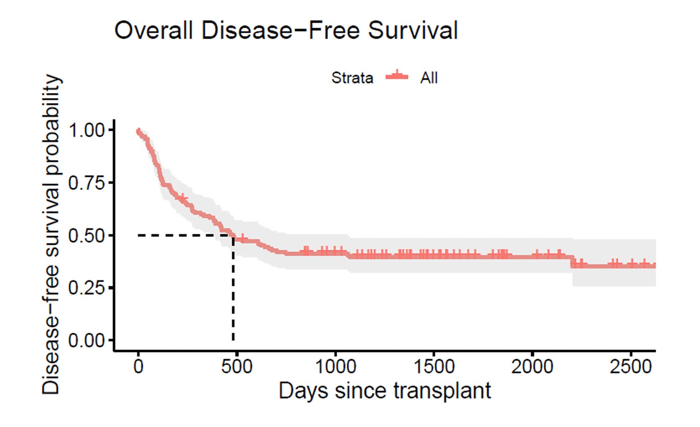

# Bone Marrow Transplant Survival Analysis

<p align="center">
  
</p>

## Project Overview

This project investigates prognostic factors associated with disease-free survival following allogeneic bone marrow transplantation in patients with acute leukemia.

The analysis applies survival analysis methods to evaluate how baseline patient characteristics and post-transplant clinical events influence disease-free survival, relapse, and the development of acute graft-versus-host disease (aGVHD).

This project was completed as part of the University of Washington BIOST/EPI 537 (Survival Data Analysis in Epidemiology).

---

## Objectives

* Estimate disease-free survival after bone marrow transplantation
* Evaluate baseline prognostic factors associated with survival outcomes
* Assess whether aGVHD influences disease-free survival and relapse
* Examine the relationship between methotrexate prophylaxis and development of aGVHD
* Investigate platelet recovery using competing-risk methods

---

## Analysis Workflow

* Kaplan-Meier estimation
* Cox proportional hazards regression
* Time-dependent Cox models
* Cause-specific hazard models
* Fine-Gray competing-risk models
* Proportional Odds Cumulative Incidence Function (PO-CIF)

All analyses were conducted in **R**.

---

## Results

The analysis showed that:

* Median disease-free survival was estimated using Kaplan-Meier methods.
* FAB classification was associated with poorer disease-free survival.
* Patients with AML Low Risk demonstrated better disease-free survival than patients with ALL.
* Platelet recovery was associated with improved disease-free survival.
* After adjustment, aGVHD was not independently associated with disease-free survival or relapse.
* Methotrexate prophylaxis was not significantly associated with reduced incidence of aGVHD.

---

## Repository Contents

```text
.
├── 537bmt.Rmd
├── BoneMarrowTransplant_Report.pdf
└── README.md
```

| File                              | Description                                             |
| --------------------------------- | ------------------------------------------------------- |
| `537bmt.Rmd`                      | R Markdown containing the complete statistical analysis |
| `BoneMarrowTransplant_Report.pdf` | Final report describing methodology and findings        |

---

## Software

**Language**

* R

**Packages**

* survival
* survminer
* dplyr
* ggplot2
* cmprsk
* timereg
* mstate
* tableone

---

## Methods and Experience

This project demonstrates experience with:

* Survival analysis
* Clinical data analysis
* Time-to-event modeling
* Cox regression
* Time-dependent covariates
* Competing-risk analysis
* Statistical modeling
* Medical data visualization

---

## Dataset

The analysis uses a de-identified bone marrow transplant dataset provided for academic coursework.

The dataset is not included in this repository because of usage restrictions.

---

## Contribution

This project was completed by a three-person team.

My responsibilities included:

* Building time-dependent Cox regression models for aGVHD analyses
* Evaluating the association between aGVHD and disease-free survival
* Assessing the relationship between methotrexate prophylaxis and development of aGVHD
* Performing proportional hazards diagnostics
* Interpreting statistical results and writing the corresponding report section

---

## Possible extensions

* Validation using larger clinical cohorts
* Individualized survival prediction models
* Dynamic prediction with longitudinal clinical measurements
